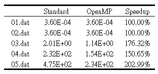

# Parallel-computing-hw04

We have implemented a straightforward yet naïve kNN algorithm in the previous assignment. There are actually some issues with the implementation. In the example given to you last time for kids in the primary school, the feature vector is composed of gender (0, 1), height (e.g. 90cm – 180cm), and weight (15kg – 80kg). The significance of value one in
different features may be completely different. For example, a difference of one in gender means boys versus girls (the two extremes), while a different of one centimeter in height is not significant at all. As a result, is it often desirable to conduct data normalization in machine learning or data analyses. There are many ways to do data normalization. In this assignment, We are going to implement “standard score” method to normalize our input data set. In the previous assignment, we’ve built a program that uses kNN to do regression or classification for a given set of “question” or “decision” files based on instances. However, we do not know how good/bad kNN is. n-fold cross
validation can be used to assess the quality of machine learning algorithms. The n-fold is now a standard way to access the suitability of machine-learning algorithms for a given problem. The idea of n-fold cross validation is to divide the instance data into two sets: 
* a training set 
* a validation set
The training set is given to the machine-learning algorithm to learn (somewhat like lectures), and the validation set (with decision variables masked/pretend to be unknown) is then fed to the machine-learning algorithm to answer. Since we know the true answer in the validation set (as they are part of the instance data), we can evaluate the machine-learning algorithm’s performance (somewhat like exams).

Overall, in this assignment, We are going to modify the kNN code to 
1) normalize feature attributes using “standardscore” method 
2) conduct k-fold cross validation to assess the predictive capability of kNN for a specified dataset.
* Additionally, because k-validation does a lot more computation than prediction done previously, so...
3) try out OpenMP to parallelize the code to make it faster! 

## Dependencies
* Ubuntu
* g++
* Valgrind 
* OpenMP - `sudo apt-get install libomp-dev`

## Setup
```sh
make         -- Produce executable file

-- Feed dataset 01 to 05 and get results
make TestCVfor01
make TestCVfor02
make TestCVfor03
make TestCVfor04
make TestCVfor05
```

## Example Result
`$ make TestCVfor02`
Output:
```
./crossValidation.exe data/02_iris.csv 6 5 4 1 0 C

        Classification error rate:      6.94444%

T: 6.8e-06, 1.73e-05, 7.3e-06, 9.255e-05, 3.59167e-05, 2.22333e-05,
./crossValidation.exe data/02_iris.csv 6 5 4 1 1 C

        Classification error rate:      10.4167%

T: 7.4e-06, 2.21e-05, 8.66667e-06, 8.19333e-05, 4.17e-05, 2.66e-05,
./crossValidation.exe data/02_iris.csv 6 5 4 1 2 C

        Classification error rate:      9.72222%

T: 6.5e-06, 1.72e-05, 7.28333e-06, 4.65167e-05, 3.60833e-05, 6.04e-05,
./crossValidation.exe data/02_iris.csv 6 5 4 1 3 C 1.75

        Classification error rate:      10.4167%

T: 8.2e-06, 2.88e-05, 8.86667e-06, 0.00016775, 3.675e-05, 2.42167e-05,
./crossValidation.exe data/02_iris.csv 6 5 4 1 4 C

        Classification error rate:      6.25%

Time: 6.1e-06, 1.75e-05, 8.06667e-06, 0.000220917, 4.135e-05, 2.57667e-05,

```
## Analysis
Unit: sec
<!-- Table -->
<br />
        <p align="left">
                       
        </p>
<br/>

## Discussion
1. In order to improve the performance, in our code, all data are dynamically allocated in a one-dimensional array that used to simulate multi-dimensional arrays.
2. If the data size is too small, the OpenMP version performance gets worse rather than better, so we set the limit to avoid this condition.(like if data size smaller than 3000, the program will not parallel computing.)
3. because of the size limit condition setting, use 01.dat, and 02.dat to run the program of two versions will get the same execution time. 

## Folder Structure
* Data is saved into the `data` folder.
* Header files is saved into the `inc` folder.
* Code is saved into the `src` folder.

## Contact

Abbey, Chen - encoref9241@gmail.com

Project Link: [Parallel-computing-hw03](https://github.com/EasternGD/Parallel-computing-hw03.git)
